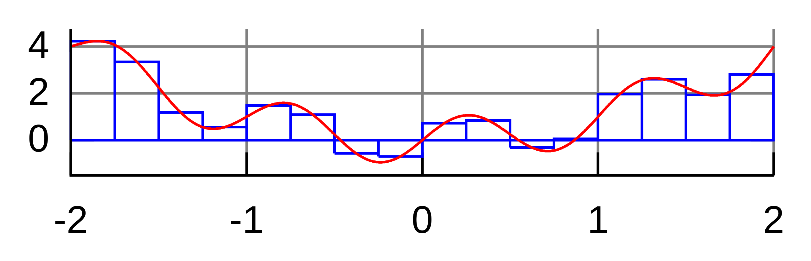

Note: this is an .md (markdown) file which contains formatting. Please open it directly on github website.

# Assignment

`example_1.cpp` is about basic use of `if`. 

`example_2.cpp` is about `cmath` and math functions with a bit more of `if`. 

`example_3.cpp` is a basic example about summing a series of numbers. This assignment comes after these three examples.

I hope you know what integral is. If not, here is a very quick and very inaccurate tour. Just enough to prepare you for the assignment. Have a look at the following picture (from https://en.wikipedia.org/wiki/Numerical_integration).

The red curve is some function $f(x)$ drawn from $x=-2$ to $x=2$. The integral of $f(x)$ over the interval $[-2,2]$ is simply the area under the curve. Under the curve here means between the curve and the x-axis. When the curve goes below the x-axis, the area becomes negative. Now do you agree that the area of all the blue rectangles is almost the same as the area under the curve? The thinner they are, the better the approximation is. This is a very simple way of calculating an integral.

Now in a bit more formal way: You can approximately calculate the integral of $f(x)$ over $[a,b]$, shown as
$$ S = \int_a^b f(x) dx $$
by doing the following summation:
$$ \tilde{S} = \sum_{i=0}^{N-1} f(i\Delta+\frac{\Delta}{2}) \Delta $$ 
where $\Delta$ is the width of the blue recatngles and $i\Delta+\frac{\Delta}{2}$ is the center of the $i^\mathrm{th}$ blue rectangle on x-axis. So clearly $f(i\Delta+\frac{\Delta}{2}) \Delta $ is the area of the $i^\mathrm{th}$ rectangle. Agree?

Now a bit about $sin(x)$ as it's also part of the assignment. You know that the sine function is periodic right? That is, $sin(x+k2\pi)=sin(x)$ for any $k\in\mathcal{Z}$. Did you also know that the integral of $sin(x)$ over one period is zero? For example, 
$$\int_0^{2\pi} sin(x) dx = 0.$$ 
(if you didn't know, just take a look at its curve and you'll see the area above the x-axis is exactly the same the area below the x-axis. so they cancel out.)

Now we just want to calculate the above integral and make sure it is actually zero!

# Problem statement
Write a C++ program that calculates the integral of $sin( x)$ over $[0,2\pi]$ with $N=10$ and then redoes that with $N=20$ and then again with $N=40$ and so on. Everytime $N$ is doubled. You expect to see the result get closer to zero as $N$ increases. The user chooses how many iterations to run. here is an example:

    How many iterations?10
    The integral for N = 10 is 1.66533e-16
    The integral for N = 20 is 3.33067e-16
    The integral for N = 40 is -2.39392e-16
    The integral for N = 80 is 8.98153e-16

Something odd about the result? Here is a bonus assignment for those who're interested: Try to explain these numbers, where they come from, and why they don't decrease with $N$. Put your explanation in `explanation.md` and submit it along with your solution. (This is just a bonus, just skip it if you don't have enough time)

You must use `basic_integral.cpp` as the file name and save it in this folder.

To learn about how assignments and submissions work, see readme.md of the repository.