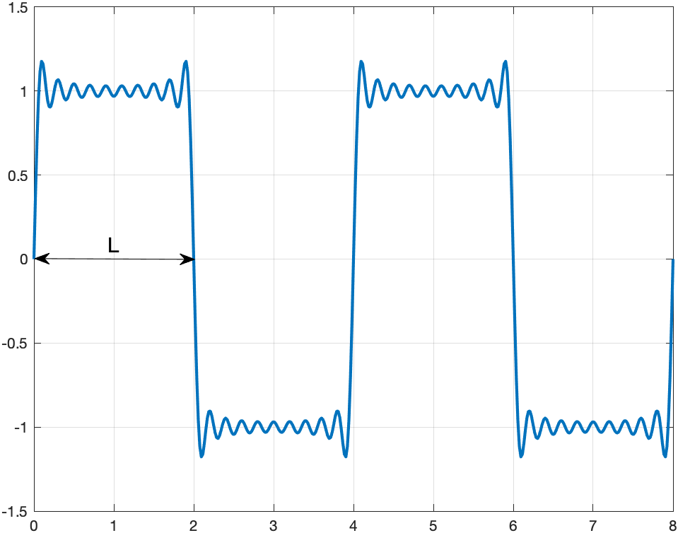

Note: this is an .md (markdown) file which contains formatting. Please open it directly on github website.

In `example_1.cpp`, we learned how to generate samples of a signal (x-y points on a function). In this assignment, you will do exactly the same thing but for the more complicated signal $s(t)$

$$ s(t) = \frac{4}{\pi} \sum_{n=0}^{N-1} \frac{1}{2n+1} \sin(2\pi \frac{2n+1}{2L}t) $$

If you calculate $s(t)$ for a large $N$ and plot it, you will see that it looks like a so-called pulse train. The higher the $N$, the closer it gets to a perfect pulse train. The length of one pulse is $2L$, as shown the figure below.

As in `example_1.cpp`, you first need to define a sequence of values of $t$ as $t_0, t_1, \ldots, t_{M}$ with 
$$\Delta t= \frac{2L}{\alpha(2N+1)}$$
where $\alpha$ controls the resolution. 

Here is an example for $N=10$ and $L=2$ with $t_0=0$, $t_M=4L$ and $\alpha=10$.

 
# Problem statement
Write a C++ program that calculates $s(t)$ in $t\in[-0.1,2.1]$, for $L=1$ and $\alpha=2$. 
Save your code in `pulse.cpp` and store it in this folder. You can use the already existing `dump_signal()` function from `basic_signal_logging.cpp` as well as `basic_plot.m`. In addition to your code, please upload four `.png` figures that show $s(t)$ for $N=2, 4, 8, 16$.
