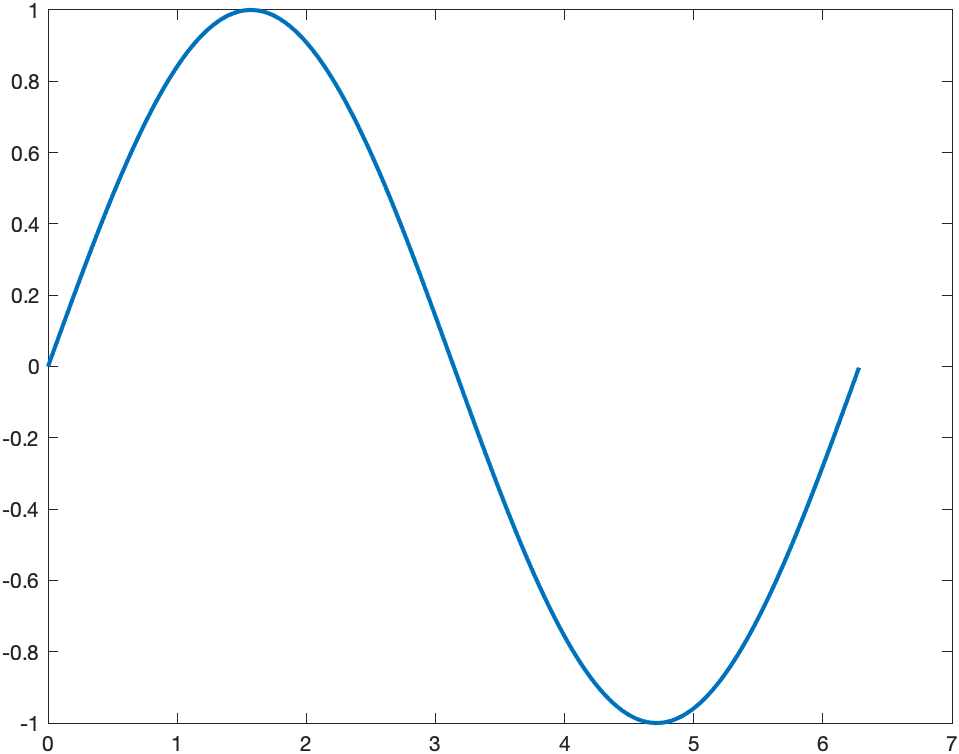

Note: this is an .md (markdown) file which contains formatting. Please open it directly on github website.

`example_1.cpp` generates a sinusoidal signal (function) and 
saves the result in a text file. You can then use basic_plot.m in MATLAB
to plot the result.

You know functions from your highschool mathematics. For example,
$f(x) = x^2 + 2$ tells you about the function $f$. You exactly know
the relation between $x$ and $f(x)$. You have a mathematical expression for $f(x)$.

There is a lot to say about what a computer could understand from a mathematical expression.
 But here we do it in a very simple way. Assume the computer doesn't understand $f(x)$ at all. All you can do is to provide a number of points on $f(x)$. 

 So let's say we'd like to plot $f(x)=\sin(x)$ over $[0,2\pi]$. First you need to define a number of points on x-axis $x_0, x_1, \ldots, x_n$. Then calculate $f(x_0), f(x_1), \ldots$. Then you can connect the points $x_i, f(x_i)$ sequentially by a straight line to draw the function. If $\Delta x = |x_{i+1}-x_i|$ is small enough, your curve will look nice. (One of the important things you learn from the theory of Signals and Systems, which is a course in some undergraduate degrees, is how small  $\Delta x$ should be to have all the information you need about $f(x)$.)

 `example_1.cpp` does the calculations. Then saves the values of $x$ and $f(x)$ in a text file. Then you run `basic_plot.m` in MATLAB which reads the text file and plots the curve using `plot()` function which does nothing but drawing a straight line between the points. You should see something like the following figure

 